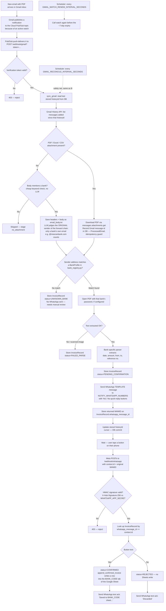
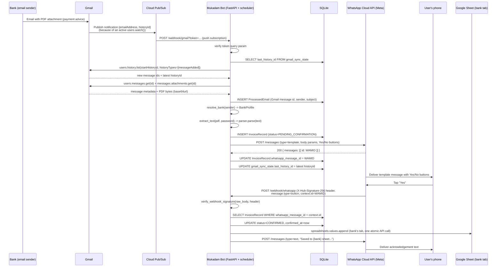

# Workflow — Gmail (real-time) → PDF Extraction → WhatsApp Confirmation → Google Sheets

This document describes exactly what the code in this repo does, step by
step, using the real mechanics of the Gmail API, Cloud Pub/Sub, the
WhatsApp Cloud API and the Sheets API — not a simplified/idealized version
of the flow. Anywhere a real decision depends on information only you have
(which banks, template copy approved by Meta, Google Cloud project
details), it is called out explicitly in **"Open decisions"** rather than
assumed.

> Ingestion was originally designed around IMAP polling. It now uses the
> Gmail API with Cloud Pub/Sub push notifications instead, per your
> decision to connect Gmail API for real-time delivery, and writes to
> Google Sheets instead of local `.xlsx` files. IMAP is not used anywhere
> in this codebase anymore.

## Components

| Component | Responsibility | Code |
|---|---|---|
| Gmail watch | Tells Gmail to publish a Pub/Sub notification on every new inbox message | [`app/services/gmail_service.py`](../app/services/gmail_service.py) `start_watch()` |
| Pub/Sub push webhook | Receives Gmail's "something changed" ping | [`app/routers/gmail_webhook.py`](../app/routers/gmail_webhook.py) |
| History sync | Turns a ping into actual new message ids via the Gmail History API | [`app/services/gmail_service.py`](../app/services/gmail_service.py) `list_new_message_ids()` |
| Message fetch | Downloads a message's PDF / Excel / CSV attachment(s); with none, saves the email body (HTML tables kept as rows) as `email_body.txt` so it goes through the same steps (`save_body_document()`) | [`app/services/gmail_service.py`](../app/services/gmail_service.py) `fetch_email()` |
| Bank registry | Maps the email's `From` address to a bank profile (parser + PDF password) | [`app/bank_registry.py`](../app/bank_registry.py) |
| PDF extractor | Decrypts (if needed) and pulls raw text out of the PDF | [`app/services/pdf_extractor.py`](../app/services/pdf_extractor.py) |
| Bank-specific parser | Turns raw PDF text into structured fields (amount, date, ref no, ...) | [`app/parsers/`](../app/parsers/) |
| Pipeline | Orchestrates the above, persists a `PENDING_CONFIRMATION` row, triggers WhatsApp | [`app/pipeline.py`](../app/pipeline.py) |
| WhatsApp service | Sends the confirmation template, verifies webhook signatures, parses button replies | [`app/services/whatsapp_service.py`](../app/services/whatsapp_service.py) |
| WhatsApp webhook | Receives the Yes/No button tap, triggers the Sheets write | [`app/routers/whatsapp_webhook.py`](../app/routers/whatsapp_webhook.py) |
| Sheets writer | Appends a row to the bank's tab in the shared spreadsheet | [`app/services/sheets_service.py`](../app/services/sheets_service.py) |
| Scheduler | Renews the Gmail watch before it expires; periodic reconciliation sync as a push-delivery safety net | [`app/worker/scheduler.py`](../app/worker/scheduler.py) |
| DB (SQLite) | Tracks the Gmail History API cursor, processed messages, and invoice status end-to-end | [`app/models.py`](../app/models.py) |

## End-to-end flow



## Emails without an attachment

Banks often send instructions as a plain email instead of a PDF — e.g. a
Meezan Bank relationship manager's "kindly take the delivery as per below
details" with the product / quantity tables in the body, forwarded two or
three times before it reaches this inbox. Such an email is handled like an
attachment:

1. `fetch_email()` reads the body. When the HTML version has a table it's
   converted with each row on one line (`Product | 40,000`), since Gmail's
   own plain-text version puts every cell on a separate line.
2. `_documents_to_read()` (app/pipeline.py) skips it without an LLM call
   unless the sender / subject / body mentions a bank somewhere (every bank
   email does, in its domain, signature or disclaimer). Otherwise the
   headers + body are saved as `<message id>_email_body.txt`.
3. The LLM (`parse_email()`) judges who wrote the **original** message at
   the bottom of the forward chain. It's a bank document only if that author
   writes for a bank and the message is a transaction / delivery /
   disbursement / payment instruction. Promotions, OTP alerts, and people
   writing about a bank are rejected (stage `not_bank`).
4. **The whole email is scanned** — subject, sender, the full forward
   chain, body text and tables, and every picture: embedded signature
   logos, pasted screenshots, attached photos / scans, and pictures the
   HTML only links to (downloaded; JPEG / PNG / GIF / WebP, up to 8,
   tracking pixels ignored). The pictures go to the vision model with the
   text: a bank's logo identifies it even when the text never names it, and
   a photographed bank document is read as content. With
   `SCAN_ALL_EMAILS=true` (default) every email is checked; `false` skips
   emails that name no bank and have no pictures, without an LLM call. An
   email where no bank can be named (domain, name, signature or logo) is
   rejected.
   Word (.docx) attachments are read too — body, tables, headers / footers
   (the letterhead) and the pictures inside (its logo).
5. A **text PDF** rejected as "not a bank document" is looked at once more
   as page images, since a bank named only in its letterhead logo isn't in
   the text layer.
6. **Invoices only, not statements.** The bot tracks invoices / bank
   documents (advices, L/Cs, delivery orders, notices), not every account
   transaction. A bank account statement is recognised and skipped (status
   `STATEMENT`, "not tracked"): a text PDF by its rows reconciling with the
   running balance (no LLM call), a scanned / Excel one by the LLM
   (`is_account_statement`). Nothing is sent or saved for it.
7. **Verification** (app/verification.py). The document's own header /
   letterhead decides bank or not. An accepted document is then checked
   against the email it came in, and the result is shown as ✓ / ⚠ lines on
   the WhatsApp prompt and in the Sheet's "Verification" column. A ⚠ warns
   the approver; it doesn't reject:
   - **Sender:** some address in the forward chain must be from that bank's
     domain (Meezan PDF ↔ …@meezanbank.com).
   - **Our company:** the document must be addressed to or about
     `OUR_COMPANY_NAMES` (.env).
8. With attachments, only the attachments decide. When none is a bank
   document — e.g. a customer's own request letter that a bank officer
   forwarded with "please arrange as per attached request" — the whole
   email is rejected; its body is not checked instead.
7. Several same-shaped tables (one per disbursement date) are merged into
   one items table with a `Disbursement` column; the WhatsApp prompt shows
   the total quantity.

## Sequence diagram — one invoice, confirmed



## Google API setup (one-time, manual — cannot be scripted headlessly)

1. **Google Cloud Console**: create/select a project. Enable the **Gmail
   API** and the **Google Sheets API** (APIs & Services → Library).
2. **OAuth consent screen**: type **External** (this is a personal Gmail
   account, not Workspace). Add your own Gmail address as a **test user**.
   You do not need Google's app-verification review for personal,
   single-user use — you will see an "unverified app" warning when you
   authorize it yourself in step 5, which is expected and safe to click
   through since you are both the developer and the only user.
   - Testing-mode OAuth apps can be subject to shorter-lived refresh
     tokens. If `scripts/gmail_oauth_setup.py`'s token stops working after
     about a week, move the consent screen's publishing status to
     **In production** (still fine without full verification, for the
     reason above) and re-run the script once.
3. **Credentials → Create OAuth client ID**, type **Desktop app**. Download
   the JSON and save it as `credentials/client_secret.json` (path matches
   `GOOGLE_CLIENT_SECRETS_FILE` in `.env`).
4. **Cloud Pub/Sub**:
   ```bash
   gcloud pubsub topics create gmail-mukadam-bot
   gcloud pubsub topics add-iam-policy-binding gmail-mukadam-bot \
     --member="serviceAccount:gmail-api-push@system.gserviceaccount.com" \
     --role="roles/pubsub.publisher"
   ```
   (`gmail-api-push@system.gserviceaccount.com` is Google's own fixed
   service account for this — required so Gmail is allowed to publish to
   your topic.)
   Then, once this app is deployed somewhere with a public HTTPS URL (or
   tunneled via `ngrok` in development):
   ```bash
   gcloud pubsub subscriptions create gmail-mukadam-bot-sub \
     --topic=gmail-mukadam-bot \
     --push-endpoint="https://<your-public-host>/webhook/gmail?token=<PUBSUB_VERIFICATION_TOKEN>"
   ```
   Set `GOOGLE_PUBSUB_TOPIC=projects/<your-project-id>/topics/gmail-mukadam-bot`
   and `PUBSUB_VERIFICATION_TOKEN` (any random string you generate) in `.env`.
5. **Authorize the app**: `python scripts/gmail_oauth_setup.py` — opens a
   browser, you log in as yourself and grant the Gmail-readonly + Sheets
   scopes, and it writes `credentials/token.json`.
6. **Create the output spreadsheet**: a blank Google Sheet, owned by the
   same account. Copy its id from the URL
   (`https://docs.google.com/spreadsheets/d/<ID>/edit`) into
   `GOOGLE_SHEETS_SPREADSHEET_ID`.
7. Start the app once — `init_db()` creates `gmail_sync_state` with no row
   yet; the first sync (webhook or `/invoices/poll-now`) calls
   `users.watch()` to establish the baseline `historyId` and register the
   watch itself.

## Why the confirmation prompt must be a WhatsApp *template*, not a plain interactive message

This is a platform rule, not a design choice:

- WhatsApp only allows a **business-initiated** message (the bot messaging
  the user because an email arrived — the user did not message first) if it
  uses a **pre-approved Message Template**. A free-form `type: interactive`
  message with dynamic buttons can only be sent **inside a 24-hour session**
  that the user opened by messaging the business first.
- Because of that, the Yes/No buttons on the *first* message come from a
  template with two **static** Quick-Reply buttons (their label and payload
  are fixed at template-creation time, identical on every send — they
  cannot be parameterised per invoice).
- Consequently the bot **cannot** encode "invoice #123" inside the button
  itself. Correlation between "which invoice is this Yes/No answering" is
  done via `context.id` in the webhook payload, which WhatsApp sets to the
  WAMID (message id) of the template message the user replied to — that
  WAMID is what `InvoiceRecord.whatsapp_message_id` stores.
- Once the user taps a button, that opens a 24h session, so the
  "Saved to sheet" acknowledgement can be sent as a plain `type: text`
  message.

The template must be created and approved in Meta Business Manager before
this works. Suggested body (edit to taste, then set `WHATSAPP_TEMPLATE_NAME`
in `.env` to whatever you name it):

```
Category: UTILITY
Body: New payment advice from {{1}}. Amount: {{2}}. Date: {{3}}. Ref: {{4}}.
      Save this to the sheet?
Buttons (Quick Reply): "Yes"   "No"
```

`app/pipeline.py::_send_confirmation` fills `{{1}}..{{4}}` with
`bank_display_name, amount, txn_date, reference_number` in that order — if
you approve a template with a different number/order of placeholders, that
call site must be updated to match.

## Bank identification — by sender address, not by guessing PDF content

`app/bank_registry.py` maps the email's `From` address to a `BankProfile`.
This is the reliable signal because bank alert/statement mailboxes send
from fixed, known addresses. The registry ships **empty** — no bank is
pre-configured — because:

- The exact sender address per bank is something only you know (it must be
  copied from a real email you've received).
- Whether that bank's PDFs are password-protected, and what the password
  is derived from (PAN, customer ID, account number, DOB, some
  concatenation of these) varies per bank and is not discoverable without a
  real sample.
- The field layout inside the PDF (labels, currency formatting, date
  format) is bank-specific and needs a real sample PDF to write a correct
  parser against.

An email from a sender that matches no configured `BankProfile` is stored
with `status=UNKNOWN_BANK` and **no WhatsApp message is sent** — it is not
guessed into some bank's sheet. It's visible via `GET /invoices` for manual
handling.

### Onboarding a new bank

1. Find a real email from that bank containing the PDF, note the exact
   `From:` address.
2. If the PDF is password-protected, determine the password pattern (open
   it manually once to confirm) and add an env var for it (e.g.
   `HDFC_PDF_PASSWORD=...`), referenced via `pdf_password_env`.
3. Register a `BankProfile` in `app/bank_registry.py` with a unique
   `bank_code` (this becomes that bank's tab name in the spreadsheet),
   leaving `parser` unset. That alone is enough to go live — the default
   LLM parser (see next section) handles extraction from there.
4. Optional, once you've seen enough of that bank's real invoices to trust
   it: write a rule-based parser implementing
   `InvoiceParser.parse(text) -> ExtractedInvoice` in `app/parsers/<bank>.py`
   (regex, or fixed positions if the layout is stable — see
   `app/parsers/generic_parser.py` for the shape, but don't reuse its
   regexes as-is, they're an unverified generic fallback) and pass it as
   `parser=` to override the default for that one bank.

## PDF field extraction: LLM-first, rule-based override

Two different concerns, kept separate:

- **Which bank is this** — decided by sender address only (previous
  section), never guessed from PDF content.
- **How do we read the fields out of its PDF** — decided per
  `BankProfile.parser`:
  - `parser=None` (the default) → `app/parsers/llm_parser.py`'s
    `LlmInvoiceParser`, shared across every bank that hasn't been given its
    own parser yet.
  - `parser=<YourBankParser()>` → your rule-based regex/positional parser
    for that one bank, once you've written and verified one.

This is deliberately **not** built on an agent framework (LangGraph,
Google ADK, etc.) — extracting a fixed set of fields from one document is a
single structured-output call, not a multi-step tool-using loop, so there
is nothing for an agent orchestrator to coordinate.

Extraction is routed through **OpenRouter** (an OpenAI-compatible Chat
Completions API), via the standard `openai` Python SDK pointed at
OpenRouter's base URL. This means `LLM_EXTRACTION_MODEL` can be pointed at
any model OpenRouter serves — Claude, GPT, Gemini, etc. — behind one
`OPENROUTER_API_KEY`, without a code change. The default,
`anthropic/claude-sonnet-4.5`, was chosen for its accuracy reading
financial documents and its native PDF support (see vision mode below).

**Two extraction modes inside `LlmInvoiceParser`, chosen automatically:**

1. **Text mode** (`parse`) — the normal path. `pdfplumber` pulls the PDF's
   text layer, which is handed to the model with a forced tool call
   (`record_invoice_fields`) constraining the output to the exact schema
   `ExtractedInvoice` needs. This handles unstructured/paragraph-style
   wording fine — an LLM reads prose, it isn't a regex — as long as the PDF
   *has* a text layer.
2. **Vision mode** (`parse_from_pdf_bytes`) — triggered automatically
   (`app/pipeline.py::_extract_invoice`) when the PDF has **no** text layer
   at all (a scanned document). The decrypted PDF bytes are sent as a
   native PDF file input via OpenRouter's file-parser plugin
   (`engine: "native"`, so a model with its own PDF vision support — like
   the default Claude model — reads the scanned pages directly rather than
   OpenRouter pre-converting them). This only applies to banks using the
   default LLM parser; a hand-written rule-based parser has no vision
   fallback of its own, since it's built on regex-over-text, so a scanned
   PDF from such a bank is a genuine `FAILED_PARSE`. If you switch
   `LLM_EXTRACTION_MODEL` to a model without native PDF support, check its
   capabilities on openrouter.ai — vision mode may need adjusting.

**Financial-data safeguard**: LLM output for the `amount` field is never
trusted on its own. `_sanity_check_amount` independently scans the same
text with a plain regex and records `match` / `mismatch` /
`no_regex_match` (the last one for vision mode, where there's no text to
check against). A `mismatch` is folded into the WhatsApp confirmation
prompt itself — the amount shown gets an appended `(unverified — please
check PDF)` — so the person tapping Yes/No sees the warning before
approving, rather than the tool silently trusting an unverified figure.
Changing this to add a dedicated template placeholder instead of appending
to the amount field is possible, but requires re-approving the WhatsApp
template with Meta (see the template section above) — not done here to
avoid a second review cycle before this is testable.

## Google Sheets output

One spreadsheet (`GOOGLE_SHEETS_SPREADSHEET_ID`), one tab per bank — tab
name equals `bank_code`. The tab and its header row are created
automatically the first time that bank produces a confirmed invoice.
Columns: Invoice ID, Transaction Date, Amount, From (Sender), To
(Receiver), Reference Number, Source Email Sender, PDF Filename, Confirmed
At. Writes go through `spreadsheets.values.append`, a single atomic
server-side call — no local file locking is needed (unlike a local `.xlsx`
file, which this replaces).

## Idempotency & failure handling

- **Duplicate message processing**: every Gmail message's internal `id` is
  stored in `ProcessedEmail` before it's parsed; already-seen ids are
  skipped even if the same message shows up again in a later
  `history.list` page (Gmail's History API can return overlapping ranges).
- **Duplicate/out-of-order Pub/Sub delivery**: Pub/Sub explicitly does not
  guarantee exactly-once or in-order delivery. This is why the webhook
  never trusts the notification's own `historyId` as a cursor — it always
  re-syncs from the app's own stored `gmail_sync_state.last_history_id`,
  making repeated or out-of-order pushes safe no-ops.
- **Duplicate WhatsApp webhook delivery**: Meta may retry a webhook POST.
  Because the handler only acts when `InvoiceRecord.status ==
  PENDING_CONFIRMATION` and immediately flips it to `CONFIRMED`/`REJECTED`,
  a retried delivery for an already-handled invoice is a no-op.
- **Stale historyId** (older than Gmail's retention window, roughly a few
  days — e.g. after this app has been down for a while): `history.list`
  rejects it; `sync_gmail` catches that and re-baselines via a fresh
  `watch()` call rather than looping on a call that can never succeed. Any
  emails that arrived during the downtime and fall in the gap are not
  retroactively recovered by this — see "Known gaps".
- **Wrong/missing PDF password, corrupt PDF**: stored as `FAILED_PARSE`
  with the error message in `InvoiceRecord.parse_error`; no WhatsApp
  message is sent for it. A scanned/no-text-layer PDF is **not** in this
  bucket for banks on the default LLM parser — see "PDF field extraction"
  above for the vision-mode fallback; it only reaches `FAILED_PARSE` if
  vision mode itself fails, or if the bank has a rule-based parser (which
  has no vision fallback).
- **WhatsApp send failure** (rate limit, invalid template, number not
  opted in): stored as `SEND_FAILED`; the extracted data is not lost, it's
  just not yet in front of the user for confirmation.
- **Forged WhatsApp webhook calls**: rejected with HTTP 403 unless
  `X-Hub-Signature-256` validates against `WHATSAPP_APP_SECRET`.
- **Forged Gmail push calls**: rejected with HTTP 403 unless the `token`
  query parameter matches `PUBSUB_VERIFICATION_TOKEN` — without this,
  anyone who found the webhook URL could trigger arbitrary syncs (low
  severity, since sync only pulls from your own mailbox, but still an
  unauthenticated trigger worth closing off).

## Known gaps (explicitly not implemented — flagged, not silently assumed)

- **Multi-item / trade-finance documents (e.g. Letters of Credit), up to
  ~100 pages, needing line-item fields like product, type, rate (USD)**:
  **not implemented.** `ExtractedInvoice` and the Google Sheets row shape
  are both built for one payment advice → one row (date, amount, from, to,
  reference). A document with multiple line items needs a different
  output shape (one row per line item? a nested block? a separate tab
  layout entirely?) and very likely a different WhatsApp confirmation
  flow, since "the whole 100-page document, yes or no" is a different
  question than "these N line items, yes or no per item". Both the field
  list and the confirmation UX for this document type need to come from
  you before it's built — see "Open decisions".
- **Vision-mode extraction cost/latency for very large documents**: even
  once wired up for a new document type, a ~100-page PDF sent as a native
  document input costs meaningfully more tokens (and takes longer) per
  call than a 1-2 page payment advice. Not a blocker, just a real
  cost/latency difference worth knowing going in — not something to
  discover from a bill.
- **Downtime gap recovery**: if the app is down long enough that the
  stored `historyId` falls outside Gmail's retention window, the
  re-baseline in `sync_gmail` picks up a fresh cursor from "now" —
  invoices that arrived strictly during the outage and before that
  re-baseline are not automatically replayed. A manual fix (searching the
  mailbox for unprocessed messages in that window) would be needed for
  that specific edge case; not built here since it is an operational
  runbook step, not application logic.
- **Multiple approvers / routing by mailbox**: the current design sends
  every confirmation prompt to `NOTIFY_WHATSAPP_NUMBERS[0]`. If different
  banks or amount thresholds should route to different approvers, that
  routing rule needs to be specified — it isn't guessed here.
- **No bank is pre-configured** — see "Onboarding a new bank" above; the
  pipeline is fully wired but produces `UNKNOWN_BANK` records until at
  least one `BankProfile` is added.

## Open decisions (need your input before production use)

1. Which banks, and each bank's exact alert-email sender address.
2. Whether each bank's PDF is password-protected, and the password pattern.
3. A sample real PDF per bank, to build/verify the field-extraction regexes
   against (the shipped parser is an unverified generic fallback only).
4. Your Google Cloud project details (project id, chosen Pub/Sub topic
   name) — needed to fill `GOOGLE_PUBSUB_TOPIC`.
5. Where this app will run with a public HTTPS URL (needed for both the
   Pub/Sub push subscription and the WhatsApp webhook) — a real host, or
   `ngrok`/similar for development.
6. WhatsApp Business setup: Meta Business Account, phone number, and the
   approved template's exact wording (Meta must approve the copy).
7. Who should receive the confirmation prompts (`NOTIFY_WHATSAPP_NUMBERS`),
   and whether that should ever vary by bank/amount.
8. `OPENROUTER_API_KEY` and, if you want a different cost/latency/accuracy
   tradeoff than the default `anthropic/claude-sonnet-4.5`, which model on
   openrouter.ai to set `LLM_EXTRACTION_MODEL` to.
9. **Letter-of-credit / multi-item trade documents** (raised as a real
   scenario, not yet designed — see "Known gaps"): the exact field list
   (product, type, rate in USD — and what else: quantity, LC number,
   applicant/beneficiary, expiry date, port of loading?), whether it's one
   row per line item or one row per document, and whether it goes through
   the same WhatsApp Yes/No gate or something else (a 100-page document is
   a very different confirmation UX than a one-line payment advice).
